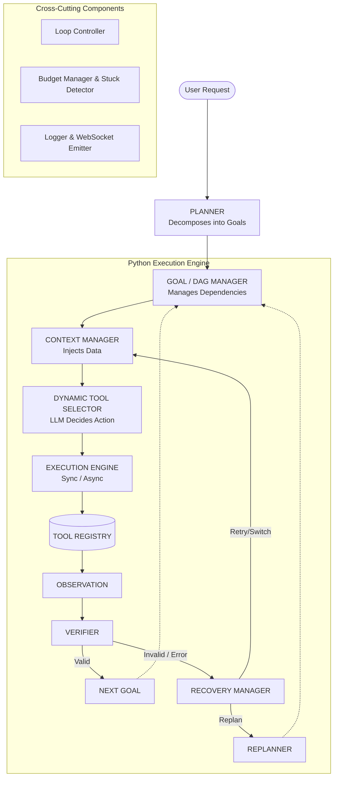

# Custom AI Agent Framework

> **Hackathon Submission:** VIT Chennai
> **Track 2:** Build the Brain, Not the Puppet

## Overview
This project implements a fully custom, autonomous, task-solving AI agent. Rather than relying on black-box orchestration frameworks like LangChain, CrewAI, or AutoGen, we have built the entire **Agentic Brain (Orchestration Loop)** from scratch. The framework breaks down complex tasks, manages dependencies, intelligently routes tool usage, verifies outcomes, and gracefully recovers from failures—all driven by a team-owned Python orchestration loop.

## The Problem
Many AI applications use fixed pipelines and hardcoded tool routing. While easy to build, these systems break down when faced with ambiguity, unexpected API errors, or tasks requiring multi-step reasoning. To solve real-world problems autonomously, an agent needs dynamic planning, context-aware tool selection, output verification, and robust failure recovery.

## Key Features
* **Custom Agent Loop:** A sophisticated `Plan → Act → Observe → Verify → Recover/Replan` loop.
* **Goal/DAG Dependency Management:** Complex tasks are decomposed into a Directed Acyclic Graph (DAG) of goals.
* **Async Parallel Execution:** Independent goals are executed concurrently via `asyncio` for maximum efficiency.
* **Dynamic Tool Selection:** The LLM decides the strategy; the framework safely manages execution.
* **Robust Failure Recovery:** Built-in error detection, automatic retries, and replanning upon tool failure.
* **Context Management:** Results from previous goals automatically feed into subsequent dependencies.
* **Verification:** LLM-based output verification to ensure goals are genuinely met before proceeding.
* **Budget Management & Stuck Detection:** Prevents infinite loops by strictly managing iterations, tool calls, LLM usage, and detecting deadlocks.
* **Live Execution Dashboard:** A React/Vite frontend connected to a FastAPI backend via WebSockets streams live execution traces.

## Architecture



## How Tool Selection Works
A core principle of this framework is the strict boundary between the LLM and execution:
* **The LLM decides WHAT action is needed** based on its reasoning.
* **The Python framework decides HOW it is executed** and whether it is permitted.
* **The Tool Registry** maps the LLM's selected tool intent to the actual, safe Python implementation. 
This is **not** simple keyword-based routing; it is intent-based autonomous tool dispatching managed securely by the backend execution engine.

## Failure Recovery Flow
1. **Tool Failure:** An external API fails or a tool returns an error.
2. **Observation:** The Python execution engine catches the exception/error.
3. **Verification:** The Verifier inspects the failure.
4. **Recovery Manager:** Analyzes the error and decides to either:
   * **Retry:** With the same parameters if it's a transient issue.
   * **Switch Strategy:** Fix parameters and try again.
   * **Replan:** Trigger the Replanner to restructure the DAG if the current approach is impossible.
5. **Resume:** The loop continues seamlessly.

## Tools
* **`CalculatorTool` (Production):** Evaluates mathematical expressions accurately.
* **`WebSearchTool` (Mock):** Simulates search results and does NOT provide guaranteed live/current web data.
* **`FailingTool` (Mock/Test):** A specialized testing tool designed to fail a configurable number of times to prove and validate the agent's recovery and stuck-detection mechanics.

## Implementation Progress (Phases)
The framework was built incrementally, and Phases 1–5 implemented:
* **Phase 1:** Sequential task execution.
* **Phase 2:** DAG implementation and task dependency resolution.
* **Phase 3:** Reliability layer (Verifier, Replanner, Recovery Manager).
* **Phase 4:** Async parallel execution and strict budget/stuck detection.
* **Phase 5:** Live Execution Trace Dashboard via FastAPI and WebSockets.

## Live Dashboard
The project features a full-stack dashboard for monitoring the agent's "brain" in real-time:
* **Backend:** FastAPI serving REST endpoints and WebSocket connections.
* **Frontend:** React + Vite application.
* **Features:** Live event streaming (WebSocket), execution trace panel, and a final answer presentation UI.

## Project Structure
```text
aiagent/
├── custom-agent/
│   ├── backend/
│   │   ├── api/           # FastAPI server and RunManager
│   │   ├── context/       # Context Manager
│   │   ├── core/          # Agent orchestrator, Loop Controllers, State
│   │   ├── execution/     # Sync and Async Tool Executors
│   │   ├── llm/           # LLM Client integration (Groq)
│   │   ├── monitoring/    # Logger and Budget Manager
│   │   ├── planning/      # Planner, Replanner, DAG Manager
│   │   ├── reasoning/     # Verifier, Recovery Manager
│   │   ├── tools/         # Tool Definitions and Registry
│   │   └── main.py        # CLI Entry Point & Test Suite
│   ├── requirements.txt   # Python Dependencies
│   └── .env               # Environment Variables (API Keys)
└── frontend/
    ├── src/               # React UI Components
    ├── package.json       # Node Dependencies
    └── vite.config.js     # Vite Config
```

## Installation

### Prerequisites
* Python 3.10+
* Node.js 18+

### 1. Backend Setup
```bash
cd custom-agent
python -m venv .venv

# Activate virtual environment
# On Windows:
.\.venv\Scripts\activate
# On macOS/Linux:
source .venv/bin/activate

pip install -r requirements.txt
```

Set up your environment variables by creating a `.env` file in the `custom-agent` directory:
```env
# Example .env
GROQ_API_KEY=your_groq_api_key_here
```

### 2. Frontend Setup
```bash
cd frontend
npm install
```

## Running the Project

### CLI Mode (Interactive / Tests)
You can run the agent directly from the terminal without the web UI:
```bash
cd custom-agent

# Run interactive prompt
python -m backend.main

# Run a specific task with parallel execution enabled
python -m backend.main "Calculate 25 * 47 and search for python history" --parallel
```

### Web Dashboard Mode
1. **Start the FastAPI Backend:**
```bash
cd custom-agent
python -m uvicorn backend.api.server:app --port 8000
```
2. **Start the Vite Frontend:**
```bash
cd frontend
npm run dev
```
Open `http://localhost:5173` in your browser.

## Testing
The framework includes a comprehensive built-in test suite to validate all mechanics.
Run tests from the `custom-agent` directory:

```bash
# Run all tests (covers existing Phase 1–4 regression suite)
python -m backend.main --test-all

# Run only Phase 4 (Parallel Execution & Recovery)
python -m backend.main --test-p4

# Run only Phase 3 (Reliability & Recovery)
python -m backend.main --test-p3
```

*(Note: Phase 5 dashboard and API tests should be verified manually via the frontend/backend servers as they are not included in the automated `--test-all` suite.)*

## Example Run
**User Request:** `"What is 25 * 47 + 100?"`
1. **Planner:** Decomposes request into a single `CalculatorTool` goal.
2. **Loop Controller:** Takes the goal from the DAG Manager.
3. **Selector/Executor:** Invokes `CalculatorTool` with `25 * 47 + 100`.
4. **Observation:** Tool returns `1275`.
5. **Verifier:** Validates that `1275` satisfies the math request.
6. **Final Answer:** Agent returns the verified answer to the user.

## Hackathon Differentiator
We did not use LangChain, CrewAI, or existing agent libraries to drive the logic. The entire orchestration loop—including parallel execution, dependency resolution (DAG), context passing, output verification, and error recovery—was engineered from scratch by our team in Python. This demonstrates a deep, foundational understanding of how LLMs interact with programmatic environments.

## Technology Stack
* **Language:** Python 3, JavaScript
* **Backend Framework:** FastAPI, Uvicorn, WebSockets
* **LLM Integration:** Groq API
* **Frontend:** React, Vite
* **Environment:** `python-dotenv`

## Limitations & Future Improvements
* **Tool Ecosystem:** Currently relies on calculator and web search. Adding more real-world APIs (e.g., File System access, GitHub integration) would expand capabilities.
* **Persistent Memory:** Currently, agent context is scoped to a single run. Adding vector databases for cross-run memory is a future goal.
* **Multi-Agent Orchestration:** Upgrading the DAG manager to delegate specific goals to specialized sub-agents.

